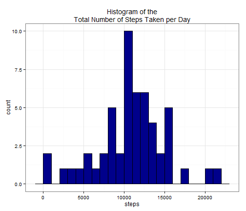
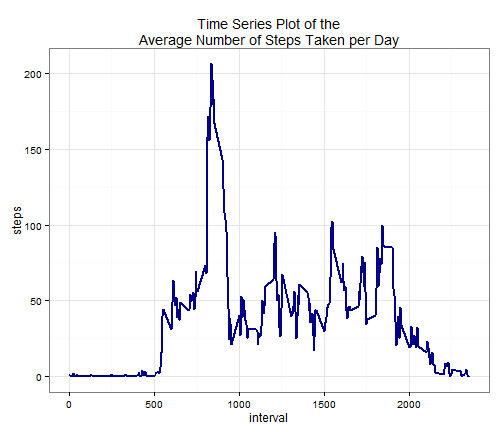
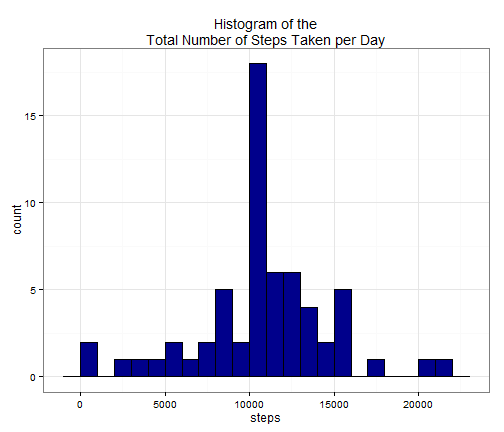
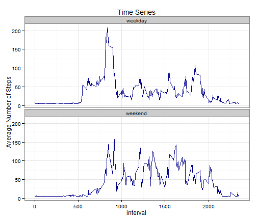

Assignment For reproducible Research Project
========================================================

First we set some globla options 


```r
opts_chunk$set(echo=TRUE,fig.path='instructions_fig/')
```


# 1.- Loading and preprocessing the data

First we load the csv file and transform date column as a Date variable.

```r
myd<-read.csv("activity.csv",header=T,stringsAsFactors =FALSE)
myd$date<-as.Date(myd$date)
head(myd)
```

```
##   steps       date interval
## 1    NA 2012-10-01        0
## 2    NA 2012-10-01        5
## 3    NA 2012-10-01       10
## 4    NA 2012-10-01       15
## 5    NA 2012-10-01       20
## 6    NA 2012-10-01       25
```

```r
str(myd)
```

```
## 'data.frame':	17568 obs. of  3 variables:
##  $ steps   : int  NA NA NA NA NA NA NA NA NA NA ...
##  $ date    : Date, format: "2012-10-01" "2012-10-01" ...
##  $ interval: int  0 5 10 15 20 25 30 35 40 45 ...
```


# 2.- What is mean total number of steps taken per day?

### 2.1.- Make a histogram of the total number of steps taken each day

We are going to use the ggplot2 plotting system to represent the histogram


```r
if (require(ggplot2)) library(ggplot2)
```

```
## Loading required package: ggplot2
```

```r
# The aggregate function help us with the total number of steps taken each day
stepsTakenPerDay <- aggregate(steps ~ date, myd, sum, na.action = na.omit)
ggplot(stepsTakenPerDay, aes(x=steps))+geom_histogram(binwidth=1000,colour="black", fill="darkblue")+ theme_bw() +
  ggtitle("Histogram of the\nTotal Number of Steps Taken per Day")
```

 

### 2.2.- Calculate and report the mean and median total number of steps taken per day


```r
#Mean Computation
meanComp<-mean(stepsTakenPerDay$steps)
#Median Computation
medComp<-median(stepsTakenPerDay$steps)
sprintf("The mean of total number of steps taken per day is equal to %.2f",meanComp)
```

```
## [1] "The mean of total number of steps taken per day is equal to 10766.19"
```

```r
sprintf("The median of total number of steps taken per day is equal to %.2f",medComp)
```

```
## [1] "The median of total number of steps taken per day is equal to 10765.00"
```

The mean is 1.0766 &times; 10<sup>4</sup> and the median is 10765


# 3.- What is the average daily activity pattern?

### 3.1.- Make a time series plot (i.e. type = "l") of the 5-minute interval (x-axis) and the average number of steps taken, averaged across all days (y-axis)
In order to get the average daily activity pattern, firstly we need to TO AVERAGE the number of steps taken for each time interval (throughout all days).  


```r
stepdByInterval<-aggregate(steps ~ interval,data=myd,FUN=mean,na.action = na.omit)
ggplot(stepdByInterval, aes(x=interval, y=steps)) + geom_line(stat="identity",colour="darkblue",size=.88) + theme_bw() +
  ggtitle("Time Series Plot of the\nAverage Number of Steps Taken per Day")
```

 

### 3.2.- Which 5-minute interval, on average across all the days in the dataset, contains the maximum number of steps?

There are different ways to compute this computation. You can split computations or do it straightaway:


```r
maxInterval <- stepdByInterval$interval[which.max(stepdByInterval$steps)]
sprintf("The 5-minute interval which contains the maximum number of steps is %d",maxInterval)
```

```
## [1] "The 5-minute interval which contains the maximum number of steps is 835"
```

```r
sprintf("...and the maximum number of steps is in the %dth interval",which.max(stepdByInterval$steps))
```

```
## [1] "...and the maximum number of steps is in the 104th interval"
```

# 4.- Imputing missing values

We need to pay attention beacause there are a number of days/intervals where there are missing values (coded as NA). The presence of missing days may introduce bias into some calculations or summaries of the data.


### 4.1.- Calculate and report the total number of missing values in the dataset (i.e. the total number of rows with NAs)

The total number of missing values _NA_ in the dataset can be solved throught looking for incomplete cases on the entire set:


```r
length(which(is.na(myd))) 
```

```
## [1] 2304
```

### 4.2.- Devise a strategy for filling in all of the missing values in the dataset. The strategy does not need to be sophisticated. For example, you could use the mean/median for that day, or the mean for that 5-minute interval, etc.


```r
naValuSubs <- mean(na.omit(myd$steps))
idx <- which(is.na(myd$steps))
# Substitute the value
myd$steps[idx] <- naValuSubs
```

The strightforward strategy is to use the average number of steps taken over all days (37.3826) to impute the missing NA values. And improved version may be whithin each interval.


We can check the number of _NA_ in the data frame once strategy has been applyed


```r
sum(is.na((myd)))
```

```
## [1] 0
```


### 4.3.- Create a new dataset that is equal to the original dataset but with the missing data filled in.

This question has been solved in the previous question (4.2)


```r
# idx <- which(is.na(myd$steps))
# Substitute the value
# myd$steps[idx] <- naValuSubs
mydNew<-myd
```


### 4.4.- Make a histogram of the total number of steps taken each day and Calculate and report the mean and median total number of steps taken per day. Do these values differ from the estimates from the first part of the assignment? What is the impact of imputing missing data on the estimates of the total daily number of steps?


```r
stepdByDay<-aggregate(steps ~ date,data=mydNew,FUN=sum)
ggplot(stepdByDay, aes(x=steps)) + geom_histogram(binwidth=1000,colour="black", fill="darkblue")+ theme_bw() +
  ggtitle("Histogram of the\nTotal Number of Steps Taken per Day")
```

 

```r
(meanNew <- mean(stepdByDay$steps))
```

```
## [1] 10766
```

```r
(medNew <- median(stepdByDay$steps))
```

```
## [1] 10766
```

```r
sprintf("We can compare the mean of both computations %.2f and %.2f",meanComp,meanNew)
```

```
## [1] "We can compare the mean of both computations 10766.19 and 10766.19"
```

```r
sprintf("... and we can compare the median of both computations %.2f and %.2f",medComp,medNew)
```

```
## [1] "... and we can compare the median of both computations 10765.00 and 10766.19"
```

Observe that imputing values on _NA_ did not chanche significatively the central measurements from mean and median.


# 5.- Are there differences in activity patterns between weekdays and weekends?

As a suggestion for this question it is recommended the _weekdays()_ function. Use the dataset with the filled-in missing values for this part.

### 5.1.- Create a new factor variable in the dataset with two levels - "weekday" and "weekend" indicating whether a given date is a weekday or weekend day.


```r
mydNew$day[weekdays(as.Date(mydNew$date)) %in% c("Saturday", "Sunday")] <- "weekend"
mydNew$day[!weekdays(as.Date(mydNew$date)) %in% c("Saturday", "Sunday")] <- "weekday"
mydNew[, 4] <- as.factor(mydNew[, 4])
head(mydNew)
```

```
##   steps       date interval     day
## 1 37.38 2012-10-01        0 weekday
## 2 37.38 2012-10-01        5 weekday
## 3 37.38 2012-10-01       10 weekday
## 4 37.38 2012-10-01       15 weekday
## 5 37.38 2012-10-01       20 weekday
## 6 37.38 2012-10-01       25 weekday
```

```r
# tail(mydNew)
# str(mydNew)
```


### 5.2.- Make a panel plot containing a time series plot (i.e. type = "l") of the 5-minute interval (x-axis) and the average number of steps taken, averaged across all weekday days or weekend days (y-axis). See the README file in the GitHub repository to see an example of what this plot should look like using simulated data.

The following time series plot help visualize the different behavior of the average number of steps throughout *weekdays* and *weekends*


```r
stepsNew <- aggregate(steps ~ interval + day, data=mydNew, FUN=mean)
ggplot(stepsNew, aes(x=interval, y=steps, group=1)) + geom_line(colour="darkblue") +
    facet_wrap(~ day, ncol=1) + theme_bw() +  ggtitle("Time Series") + ylab("Average Number of Steps")
```

 

